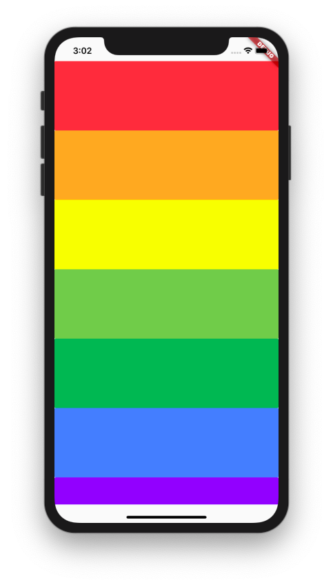

<h1 align="center">Xylophone App</h1>

<p align="center">
  
</p>

## What I learned?
 - `Packages`: how to use it, versions and why use packages. The course presents the way to include packages in your project and what are the benefits to use packages to do not waste your time creating functionalities that other developer made before and how to be safe of future updates which may broke your app.

## How to use

To clone and run this application, you'll need [Git](https://git-scm.com/downloads) and [Flutter](https://flutter.dev/docs/get-started/install) installed on your computer. From your command line:

```
# Clone this repository
$ git clone https://github.com/feMoraes0/xylophone-app.git

# Go into the repository
$ cd xylophone-app

# Install dependencies
$ flutter packages get

# Run the app
$ flutter run
```

## Contact
  - <a target="_blank" href="https://www.linkedin.com/in/fernando-moraes-48a26916a/">LinkedIn</a>
  - <a target="_blank" href="mailto:fernandomoraes.lopes@gmail.com">E-mail</a>